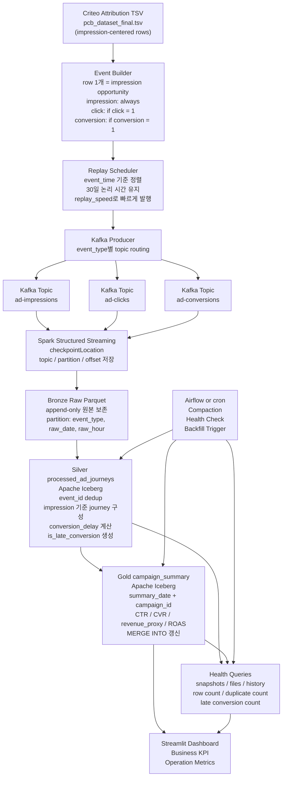

# Criteo 광고 이벤트 기반 Local Iceberg Lakehouse 

## 0. 프로젝트 목적

본 프로젝트는 Criteo Attribution Modeling 데이터를 기반으로 광고 이벤트의 수집, 정제, 집계, 운영 모니터링을 수행하는 Local Iceberg Lakehouse 파이프라인을 설계하고 구현하는 것을 목표로 한다.

광고 데이터는 일반적인 append-only 로그와 다르게, 광고 노출(impression), 클릭(click), 전환(conversion)이 서로 다른 시점에 발생한다. 특히 conversion은 impression 또는 click 이후 수 시간에서 수 일 뒤에 발생할 수 있으므로, 이미 생성된 과거 KPI가 나중에 변경될 수 있다.

따라서 본 프로젝트의 핵심은 단순히 Kafka와 Spark로 데이터를 적재하는 것이 아니라, 광고 도메인에서 실제로 발생할 수 있는 다음 운영 문제를 Lakehouse 구조로 해결하는 것이다.

1. 오프라인 Criteo TSV 데이터를 실제 이벤트 스트림처럼 replay하는 문제
2. impression, click, conversion 이벤트를 구분하여 수집하는 문제
3. Spark Streaming 재시작 또는 Producer 재전송으로 인한 중복 이벤트 문제
4. late conversion으로 인해 과거 campaign summary가 변경되는 문제
5. streaming ingestion으로 인해 small file이 증가하는 문제
6. 정제 로직 오류 발생 시 raw zone에서 backfill해야 하는 문제
7. 운영자가 매일 5분 안에 파이프라인 상태를 확인해야 하는 문제

본 프로젝트는 AWS managed service를 직접 사용하는 완성형 운영 시스템이 아니라, 비용 제약과 재현 가능성을 고려하여 Local Docker 기반으로 광고 Lakehouse의 핵심 운영 문제를 재현

---

## 1. 평가 기준 대응 요약

| 평가 기준                  | 본 프로젝트 대응                                                                                          |
| ---------------------- | -------------------------------------------------------------------------------------------------- |
| Iceberg 테이블 활용         | Silver `processed_ad_journeys`, Gold `campaign_summary`를 Iceberg table로 구성                         |
| 메달리온 아키텍처              | Bronze raw Parquet, Silver Iceberg, Gold Iceberg로 3계층 분리                                           |
| Iceberg Management 자동화 | `rewrite_data_files` 기반 compaction을 Airflow 또는 cron으로 매일 03:00 실행                                  |
| Dashboard              | QuickSight 대신 Streamlit으로 Business KPI와 Operation Metrics 탭 구성                                     |
| 운영 가시성                 | snapshots/files/history metadata table 기반 health query 작성                                          |
| Scale-out 사고력          | Kafka lag, Spark micro-batch time, Iceberg file count 기준으로 10x/100x 병목 설명                          |
| Iceberg 필요성            | late conversion으로 과거 summary가 바뀌므로 MERGE, snapshot, time travel 필요                                 |
| 협업 가능성                 | `infra/`, `code/ddl/`, `code/pipelines/`, `health-queries/`, `orchestration/`, `dashboard/` 구조로 분리 |
| 멱등성/재처리                | Bronze append-only, Silver event_id dedup, Gold summary_date+campaign_id MERGE                     |

---

## 2. 도메인 정의

### 2-1. 광고 이벤트 생명주기

광고 플랫폼에서는 일반적으로 다음과 같은 이벤트 흐름이 발생한다.

```text
Impression → Click → Conversion
```

* `impression`: 사용자가 광고를 봄
* `click`: 사용자가 광고를 클릭함
* `conversion`: 사용자가 구매, 가입, 설치 등 목표 행동을 수행함

중요한 점은 모든 impression이 click으로 이어지지 않고, 모든 click이 conversion으로 이어지지도 않는다는 것이다. 또한 conversion은 click 직후 바로 발생하지 않고 며칠 뒤에 발생할 수 있다.

본 프로젝트에서는 이 특성을 반영하여 광고 이벤트를 단순 row 단위 데이터가 아니라 시간에 따라 흘러오는 event stream으로 재구성한다.

### 2-2. 핵심 KPI

Gold layer에서는 캠페인 단위 광고 성과를 보기 위해 다음 KPI를 계산한다.

| KPI                    | 정의                   |
| ---------------------- | -------------------- |
| Impressions            | 광고 노출 수              |
| Clicks                 | 광고 클릭 수              |
| Conversions            | 전환 수                 |
| Attributed Conversions | attribution=1인 전환 수  |
| Cost                   | 광고 비용 합계             |
| Revenue Proxy          | 전환 가치 proxy          |
| CTR                    | clicks / impressions |
| CVR                    | conversions / clicks |
| ROAS Proxy             | revenue_proxy / cost |
| Avg Conversion Delay   | 평균 전환 지연 시간          |
| Late Conversion Count  | 일정 기준 이상 늦게 발생한 전환 수 |

원본 데이터에는 실제 구매 금액이 명시적으로 제공되지 않으므로, 본 프로젝트에서는 `cpo`를 전환 가치 proxy로 사용한다. 따라서 `revenue_proxy`는 실제 매출이 아니라 Gold KPI 계산을 위한 실습용 전환 가치 지표로 해석한다.

---

## 3. 데이터 구조 확인

### 3-1. 원본 데이터

본 프로젝트에서 사용하는 데이터는 다음 파일이다.

```text
pcb_dataset_final.tsv
```

이 데이터는 Criteo Attribution Modeling 데이터 구조를 따른다. 원본 데이터는 impression, click, conversion이 각각 독립 로그로 저장된 형태가 아니라, 각 row가 하나의 광고 노출(impression)을 의미하고 그 row 안에 click 여부, conversion 여부, conversion 발생 시각, attribution 여부가 함께 포함된 impression 중심 attribution 데이터이다.

### 3-2. 원본 컬럼

원본 데이터는 다음 주요 컬럼으로 구성된다.

| 컬럼                      | 의미                      | 파이프라인 사용 방식              |
| ----------------------- | ----------------------- | ------------------------ |
| `timestamp`             | impression 발생 상대 시각     | impression event_time 생성 |
| `uid`                   | 사용자 식별자                 | user_id                  |
| `campaign`              | 캠페인 식별자                 | campaign_id              |
| `conversion`            | 전환 여부                   | conversion event 생성 여부   |
| `conversion_timestamp`  | 전환 발생 상대 시각             | conversion event_time 생성 |
| `conversion_id`         | 전환 식별자                  | conversion_id            |
| `attribution`           | attribution 여부          | attributed conversion 계산 |
| `click`                 | 클릭 여부                   | click event 생성 여부        |
| `click_pos`             | 전환 경로 내 클릭 위치           | Silver feature로 보존       |
| `click_nb`              | 관련 클릭 수                 | Silver feature로 보존       |
| `cost`                  | 광고 비용                   | Gold cost 집계             |
| `cpo`                   | 전환 가치 proxy             | revenue_proxy 계산         |
| `time_since_last_click` | 마지막 클릭 이후 시간            | Silver feature로 보존       |
| `cat1`~`cat9`           | 익명화 categorical feature | Silver feature로 보존       |

### 3-3. 샘플 데이터 분석 결과

샘플 200,000건을 확인한 결과는 다음과 같다.

| 항목                  |       값 |
| ------------------- | ------: |
| 원본 impression row 수 | 200,000 |
| click=1 row 수       |  69,419 |
| conversion=1 row 수  |  10,171 |
| attribution=1 row 수 |   5,664 |
| unique campaigns    |     655 |
| unique users        | 168,492 |

즉 원본 200,000개의 impression row를 이벤트 스트림으로 변환하면 다음 이벤트가 생성된다.

| 생성 이벤트           |      개수 |
| ---------------- | ------: |
| impression event | 200,000 |
| click event      |  69,419 |
| conversion event |  10,171 |
| 총 이벤트 수          | 279,590 |

이 구조는 광고 퍼널의 희소성을 그대로 반영한다. 모든 impression이 click으로 이어지지 않고, 모든 click이 conversion으로 이어지지 않는다.

### 3-4. Conversion Delay 분석

샘플 500,000건 중 conversion이 발생한 row 24,621건에 대해 다음 값을 계산하였다.

```text
conversion_delay_sec = conversion_timestamp - timestamp
conversion_delay_day = conversion_delay_sec / 86400
```

결과는 다음과 같다.

| 통계량    | conversion_delay_day |
| ------ | -------------------: |
| min    |           약 0.00002일 |
| 25%    |             약 0.067일 |
| median |              약 3.57일 |
| mean   |              약 7.04일 |
| 75%    |             약 12.01일 |
| max    |             약 29.99일 |

따라서 본 프로젝트에서는 conversion이 impression 이후 최대 약 30일까지 늦게 발생할 수 있다고 보고, late conversion으로 인해 과거 campaign summary가 변경되는 문제를 핵심 운영 시나리오로 정의한다.

---

## 4. 데이터 입수 및 실시간 이벤트 스트림 재구성

### 4-1. 설계 원칙

Criteo 원본 TSV는 오프라인 파일이다. 그러나 실제 광고 플랫폼에서는 impression, click, conversion 이벤트가 시간 순서에 따라 Kafka 같은 메시지 시스템으로 유입된다.

따라서 본 프로젝트에서는 원본 row를 그대로 Kafka에 적재하지 않고, Producer 단계에서 실제 광고 이벤트 스트림과 유사하게 재구성한다.

```text
Offline TSV
  → Event Builder
  → Replay Scheduler
  → Kafka Producer
  → Kafka Topics
```

### 4-2. 이벤트 생성 규칙

각 원본 row는 하나의 impression opportunity로 해석한다.

| 원본 조건                     | 생성 이벤트                        | 의미                                |
| ------------------------- | ----------------------------- | --------------------------------- |
| `click=0`, `conversion=0` | impression                    | 광고 노출 후 클릭/전환 없음                  |
| `click=1`, `conversion=0` | impression, click             | 클릭은 발생했지만 전환 없음                   |
| `click=1`, `conversion=1` | impression, click, conversion | 클릭 후 전환 발생                        |
| `click=0`, `conversion=1` | impression, conversion        | view-through conversion 또는 특이 케이스 |

본 프로젝트에서는 `click=1`인 row에 대해 대표 click event 1개를 생성한다. 원본 데이터에는 개별 click timestamp가 제공되지 않기 때문에 `click_nb`개의 클릭 이벤트를 임의로 생성하지 않는다. 대신 `click_nb`, `click_pos`, `time_since_last_click`은 Silver layer에 feature로 보존한다.

또한 `conversion=1`인 row에 대해서만 conversion event를 생성한다. 모든 click이 conversion으로 이어지는 것은 아니므로, click event와 conversion event는 분리하여 생성한다.

### 4-3. event_time 생성 방식

Criteo 원본의 `timestamp`와 `conversion_timestamp`는 실제 날짜가 아니라 상대 초 단위 시각이다. 따라서 Producer는 기준 시각을 정하고, 상대 초를 더해 논리적 event_time을 생성한다.

```text
base_time = 2026-06-16 00:00:00

impression_time = base_time + timestamp seconds
conversion_time = base_time + conversion_timestamp seconds
```

click event는 원본에 명시적인 click timestamp가 없으므로 deterministic simulation rule로 생성한다.

```text
if click = 1 and conversion = 1:
    click_time = impression_time + min(30분, max(10초, conversion_delay_sec × 0.05))

if click = 1 and conversion = 0:
    click_time = impression_time + deterministic_delay
```

여기서 `deterministic_delay`는 row_id 기반으로 10초~30분 사이의 값을 생성한다.

```text
deterministic_delay = 10초 + (source_row_id % 1790초)
```

이 방식은 다음 조건을 만족한다.

* click은 impression 이후에 발생한다.
* conversion이 있는 경우 click은 conversion 이전에 발생한다.
* 동일 입력 데이터에 대해 항상 동일한 click_time이 생성된다.
* random seed에 의존하지 않아 재현 가능한 replay가 가능하다.

### 4-4. event_time, producer_time, ingest_time 분리

본 프로젝트에서는 세 가지 시간을 분리하여 저장한다.

| 시간 컬럼           | 의미                             | 사용 목적                                  |
| --------------- | ------------------------------ | -------------------------------------- |
| `event_time`    | 광고 이벤트가 실제로 발생한 논리적 시간         | KPI 집계, partition, conversion delay 계산 |
| `producer_time` | Producer가 Kafka에 이벤트를 발행한 시간   | replay 지연 및 producer 동작 확인             |
| `ingest_time`   | Spark가 Bronze raw zone에 저장한 시간 | pipeline latency, late arrival, 장애 추적  |

이 세 시간을 분리하면 다음 개념을 구분할 수 있다.

| 개념               | 정의                                                |
| ---------------- | ------------------------------------------------- |
| Conversion Delay | impression 이후 conversion이 발생하기까지 걸린 시간            |
| Late Arrival     | conversion event가 발생한 시각보다 늦게 Kafka/Spark에 도착한 현상 |
| Pipeline Latency | Producer 발행 후 Bronze 저장까지 걸린 시간                   |

### 4-5. Replay Scheduler

생성된 impression, click, conversion event는 모두 하나의 event log로 펼친 뒤 `event_time` 기준으로 정렬한다. 이후 Producer는 `replay_speed`를 적용하여 오프라인 TSV 데이터를 Kafka에 실시간 스트림처럼 발행한다.

```text
Criteo row
  → impression / click / conversion event 생성
  → 전체 event를 event_time 기준 정렬
  → replay_speed로 발행 간격 압축
  → event_type별 Kafka topic으로 발행
```

예를 들어, 원본 논리 시간 1일을 실습 replay 시간 1분으로 압축할 수 있다.

```text
원본 논리 시간 30일 → 실습 replay 시간 30분
```

이 구조를 사용하면 event_time은 원본 데이터의 30일 conversion delay 구조를 유지하면서, 실제 실습에서는 짧은 시간 안에 전체 스트림을 재생할 수 있다.

### 4-6. Kafka Topic 분리

이벤트는 `event_type`에 따라 다음 Kafka topic으로 분리한다.

| event_type | Kafka topic      |
| ---------- | ---------------- |
| impression | `ad-impressions` |
| click      | `ad-clicks`      |
| conversion | `ad-conversions` |

topic을 분리하는 이유는 다음과 같다.

1. impression, click, conversion은 발생 시점과 도착 패턴이 다르다.
2. conversion은 late event로 도착할 수 있으므로 별도 모니터링이 필요하다.
3. event_type별 traffic 양이 다르므로 병렬성 및 scale 전략을 다르게 가져갈 수 있다.
4. downstream에서 event_type별 raw path를 명확하게 관리할 수 있다.

---

## 5. 인프라 구성

### 5-1. Local Docker 기반 MVP

초기 설계에서는 AWS S3, Glue Catalog, Athena, QuickSight를 사용하는 클라우드 기반 Lakehouse 구조를 고려하였다. 그러나 최종 프로젝트 구현에서는 과금 리스크를 줄이고 누구나 로컬에서 재현 가능한 제출물을 만들기 위해 Local Docker 기반 MVP로 구현한다.

| 역할             | 클라우드 기준 구성      | 본 프로젝트 로컬 구성                           |
| -------------- | --------------- | -------------------------------------- |
| Object Storage | S3              | local volume 또는 MinIO                  |
| Catalog        | Glue Catalog    | Spark Hadoop Catalog 또는 Hive Metastore |
| Query Engine   | Athena          | Spark SQL / DuckDB                     |
| Dashboard      | QuickSight      | Streamlit                              |
| Spark Runtime  | EMR / EKS Spark | Docker Spark Standalone                |
| Orchestration  | Managed Airflow | Airflow 또는 cron                        |
| Table Format   | Apache Iceberg  | Apache Iceberg                         |

본 프로젝트의 목적은 특정 managed service를 사용하는 것이 아니라, 광고 이벤트 데이터가 실제 운영 환경에서 겪는 문제를 Lakehouse 구조로 해결하는 것이다.

### 5-2. 로컬 구성요소

```text
Local Docker Environment
  ├─ Kafka broker
  ├─ Spark master
  ├─ Spark worker
  ├─ Iceberg warehouse
  ├─ Spark SQL / DuckDB
  ├─ Streamlit dashboard
  └─ Airflow or cron
```

### 5-3. AWS 전환은 향후 운영 후보

본 프로젝트에서는 “EMR 또는 EKS Spark로 전환”과 같은 광범위한 표현을 현재 구현 범위로 두지 않는다. 대신 운영 지표를 기준으로 어떤 부분을 확장해야 하는지 설명한다.

예를 들어 다음 지표가 지속적으로 악화될 경우 확장을 검토한다.

* Kafka consumer lag
* Spark micro-batch processing time
* processedRowsPerSecond / inputRowsPerSecond
* Iceberg file count
* average file size
* snapshot count
* dashboard query latency

---

## 6. 전체 파이프라인 구조

### 6-1. 전체 흐름



### 6-2. 파이프라인 단계별 책임

| 단계               | 역할                                                |
| ---------------- | ------------------------------------------------- |
| Event Builder    | Criteo row를 impression/click/conversion event로 분해 |
| Replay Scheduler | event_time 기준 정렬 후 replay_speed 적용                |
| Kafka Producer   | event_type별 topic routing                         |
| Spark Streaming  | Kafka consume, checkpoint, raw append             |
| Bronze           | 원본 이벤트와 Kafka metadata 보존                         |
| Silver           | dedup, journey 구성, delay 계산                       |
| Gold             | campaign KPI 집계 및 MERGE                           |
| Health Query     | 운영 상태 점검                                          |
| Streamlit        | Business/Operation dashboard                      |
| Airflow/cron     | compaction, health check, backfill trigger        |

---

## 7. 메달리온 아키텍처 설계

## 7-1. Bronze Layer: Raw Events

Bronze는 Kafka에서 수집한 이벤트를 원본에 가깝게 저장하는 계층이다.

### 저장 형식

```text
Bronze = Raw Parquet
```

Bronze에 Iceberg를 바로 적용하지 않는 이유는 이 계층의 목적이 정제나 갱신이 아니라 원본 보존과 재처리이기 때문이다.

### 저장 경로

```text
warehouse/raw/ad_events/
  event_type=impression/
    raw_date=2026-06-16/
      raw_hour=00/
  event_type=click/
    raw_date=2026-06-16/
      raw_hour=00/
  event_type=conversion/
    raw_date=2026-07-02/
      raw_hour=18/
```

### 파티션 전략

```text
event_type, raw_date, raw_hour
```

이 파티션 전략을 사용하는 이유는 다음과 같다.

1. event_type별로 raw 데이터를 빠르게 조회할 수 있다.
2. raw_date, raw_hour 기준으로 시간 단위 재처리가 가능하다.
3. daily peak 시간대의 파일 증가를 추적할 수 있다.
4. backfill 시 필요한 시간 범위만 읽을 수 있다.

### Bronze 저장 컬럼

```text
event_id
source_row_id
event_type
event_time
available_time
producer_time
ingest_time
user_id
campaign_id
impression_id
click_id
conversion_id
cost
cpo
revenue_proxy
attribution
click_pos
click_nb
time_since_last_click
kafka_topic
kafka_partition
kafka_offset
raw_date
raw_hour
```

### Bronze 운영 원칙

Bronze에서는 중복 이벤트를 삭제하지 않는다. Producer 재전송, Spark Streaming 재시작, checkpoint 초기화 등으로 중복 이벤트가 들어와도 원본 추적을 위해 append-only로 저장한다.

중복 제거는 Silver layer에서 수행한다.

---

## 7-2. Silver Layer: processed_ad_journeys

Silver는 Bronze raw event를 분석 가능한 광고 여정 단위로 정리한 Iceberg 테이블이다.

### 저장 형식

```text
Silver = Apache Iceberg
```

Silver부터 Iceberg를 사용하는 이유는 다음과 같다.

1. dedup 결과를 안정적으로 관리해야 한다.
2. click/conversion이 뒤늦게 들어오면 기존 impression journey가 갱신될 수 있다.
3. 정제 로직 변경 시 snapshot 기반 추적과 rollback이 필요하다.
4. downstream Gold summary는 Silver를 기준으로 계산해야 한다.

### Silver 처리 흐름

```text
Bronze raw events
  → event_id dedup
  → event_type validation
  → timestamp 정제
  → impression_id 기준 click/conversion 결합
  → conversion_delay 계산
  → late_conversion flag 생성
  → processed_ad_journeys Iceberg MERGE
```

### Dedup 기준

동일한 `event_id`가 여러 번 들어올 경우, `ingest_time` 기준 최신 record를 사용한다.

```sql
ROW_NUMBER() OVER (
  PARTITION BY event_id
  ORDER BY ingest_time DESC
) AS rn
```

`rn = 1`인 row만 Silver 처리에 사용한다.

### Silver 테이블 주요 컬럼

```text
impression_id
user_id
campaign_id
impression_time
click_time
conversion_time
has_click
has_conversion
is_attributed
conversion_delay_sec
conversion_delay_day
is_late_conversion
cost
cpo
revenue_proxy
click_pos
click_nb
time_since_last_click
event_date
updated_at
```

### late conversion 정의

본 프로젝트에서는 다음 기준으로 late conversion을 정의한다.

```text
is_late_conversion = conversion_delay_sec >= 86400
```

즉 impression 이후 1일 이상 지나 발생한 conversion을 late conversion으로 본다.

---

## 7-3. Gold Layer: campaign_summary

Gold는 BI dashboard와 비즈니스 KPI 조회를 위한 summary 테이블이다.

### 저장 형식

```text
Gold = Apache Iceberg
```

Gold는 late conversion이 반영될 때 과거 summary가 갱신될 수 있으므로 append-only가 아니라 MERGE 기반으로 관리한다.

### 집계 기준

```text
summary_date = impression_date
key = summary_date + campaign_id
```

Gold summary의 날짜 기준을 conversion_date가 아니라 impression_date로 잡는 이유는 late conversion 문제를 명확히 표현하기 위해서이다.

예를 들어 6월 16일에 발생한 impression이 7월 2일에 conversion으로 이어졌다면, 7월 2일 summary만 증가하는 것이 아니라 6월 16일 campaign 성과가 뒤늦게 갱신되어야 한다.

### Gold KPI

| 지표                       | 계산                        |
| ------------------------ | ------------------------- |
| impressions              | count(impression_id)      |
| clicks                   | sum(has_click)            |
| conversions              | sum(has_conversion)       |
| attributed_conversions   | sum(is_attributed)        |
| cost                     | sum(cost)                 |
| revenue_proxy            | sum(revenue_proxy)        |
| ctr                      | clicks / impressions      |
| cvr                      | conversions / clicks      |
| roas_proxy               | revenue_proxy / cost      |
| avg_conversion_delay_day | avg(conversion_delay_day) |
| late_conversion_count    | sum(is_late_conversion)   |
| updated_at               | summary 갱신 시각             |

### MERGE 기준

```sql
ON target.summary_date = source.summary_date
AND target.campaign_id = source.campaign_id
```

동일 날짜와 동일 campaign_id에 대해 summary가 다시 계산되면 기존 row를 update하고, 새로운 key이면 insert한다.

---

## 8. 데이터 처리 주기 및 파티션 전략

피드백을 반영하여 각 레이어별 처리 주기, 실행 시각, 파티션 전략을 명시한다.

| Layer        | Job                    | 처리 방식                      |             주기 | 실행 시각  | 파티션/키                                |
| ------------ | ---------------------- | -------------------------- | -------------: | ------ | ------------------------------------ |
| Producer     | `criteo_event_replay`  | Event replay               |   테스트 실행 또는 상시 | 수동/상시  | `event_type`                         |
| Bronze       | `kafka_to_raw`         | Spark Structured Streaming | 1분 micro-batch | 상시     | `event_type`, `raw_date`, `raw_hour` |
| Silver       | `raw_to_processed`     | Batch + MERGE              |            매시간 | 매시 10분 | `event_date`                         |
| Gold         | `processed_to_summary` | Batch + MERGE              |             매일 | 01:00  | `summary_date`, `campaign_id`        |
| Late Window  | `summary_rebuild_30d`  | 30일 window 재집계             |             매일 | 01:30  | 최근 30일                               |
| Compaction   | `compact_iceberg`      | Maintenance                |             매일 | 03:00  | D-1 이전 partition                     |
| Health Check | `health_queries`       | SQL check                  |             매일 | 09:00  | snapshots/files/history              |

### 8-1. Data Leakage 방지

학습용 feature table을 만든다고 가정할 경우, feature 기준 시각 이후에 들어온 conversion 정보를 사용하면 data leakage가 발생한다.

따라서 본 프로젝트는 다음 원칙을 둔다.

1. `event_time`, `producer_time`, `ingest_time`을 모두 저장한다.
2. Gold summary는 `summary_date = impression_date` 기준으로 관리한다.
3. D일 summary는 D+1 01:00에 기본 생성한다.
4. D+1 이후 도착한 late conversion은 01:30 late window job에서 최근 30일 summary를 재계산하여 반영한다.
5. 학습용 feature를 만들 경우 cutoff time 이후 ingest된 conversion은 사용하지 않는다.

---

## 9. Daily Peak 및 Scale In/Out 전략

### 9-1. 트래픽 가정

| 구분     | 가정              |
| ------ | --------------- |
| 현재 규모  | 일 100만 이벤트      |
| 평균 TPS | 약 12 events/sec |
| 피크 시간  | 오전 8시~12시       |
| 피크 트래픽 | 평소 대비 2~3배      |
| 주말 트래픽 | 평일 대비 1.5배      |
| 6개월 후  | 일 1,000만 이벤트    |
| 장기 성장  | 일 1억 이벤트        |

### 9-2. Scale 판단 지표

| 구성요소            | 모니터링 지표                                   | 대응                                  |
| --------------- | ----------------------------------------- | ----------------------------------- |
| Kafka           | consumer lag                              | topic partition 증가, consumer 병렬성 조정 |
| Producer        | send rate, error count                    | replay speed 조정                     |
| Spark Streaming | micro-batch processing time               | executor/parallelism 조정             |
| Bronze          | 파일 수, raw_hour별 row count                 | partition 확인, small file 모니터링       |
| Silver          | MERGE 처리 시간                               | 처리 window 조정                        |
| Gold            | summary 갱신 시간                             | 최근 30일 window 최적화                   |
| Iceberg         | file count, avg file size, snapshot count | compaction, expire snapshots        |
| Dashboard       | query latency                             | Gold table 중심 조회, pre-aggregation   |

### 9-3. Daily Peak 대응

피크 시간대에는 Kafka consumer lag와 Spark micro-batch 처리 시간이 증가할 수 있다.

운영 기준은 다음과 같이 둔다.

```text
if consumer_lag 지속 증가:
    Kafka topic partition 수 증가 또는 consumer 병렬성 조정

if micro_batch_processing_time > trigger_interval:
    Spark executor resource 또는 parallelism 조정

if small files 급증:
    D-1 이전 partition compaction 수행
```

현재 Local Docker 구현에서는 실제 auto-scaling을 구현하지 않는다. 대신 어떤 지표를 보고 어떤 구성요소를 조정할지 설계로 명시한다.

---

## 10. 장애 및 운영 시나리오

## 10-1. Late Conversion으로 과거 KPI가 변경되는 문제

### 상황

사용자가 6월 16일에 광고를 봤지만, conversion은 7월 2일에 발생할 수 있다. 이 경우 6월 16일 campaign summary는 처음에는 conversion이 0으로 집계되다가, 나중에 conversion event가 도착하면 갱신되어야 한다.

### 대응

1. Bronze raw에는 conversion event를 append-only로 저장한다.
2. Silver는 impression_id 기준 journey를 갱신한다.
3. conversion_delay_sec와 is_late_conversion을 계산한다.
4. Gold는 최근 30일 impression_date window를 재집계한다.
5. Iceberg MERGE INTO로 기존 campaign_summary row를 update한다.

### Iceberg 필요성

late conversion으로 과거 summary가 변경될 수 있으므로 단순 append-only Parquet summary로는 적합하지 않다. Iceberg MERGE를 사용하면 `summary_date + campaign_id` 기준으로 안정적인 upsert가 가능하다.

---

## 10-2. Spark Streaming Job 장애 또는 OOM

### 상황

Spark Structured Streaming job이 피크 시간대 또는 executor 메모리 부족으로 중단될 수 있다. 이 경우 Kafka offset 복구와 중복 이벤트 방지가 중요하다.

### 대응

1. `checkpointLocation`을 사용하여 Kafka offset과 streaming state를 복구한다.
2. Bronze raw zone은 append-only로 유지한다.
3. Producer 재전송 또는 checkpoint 초기화로 동일 event가 다시 들어와도 Bronze에서는 삭제하지 않는다.
4. Silver에서 `event_id` 기준 deduplication을 수행한다.
5. Gold는 dedup이 끝난 Silver만 기준으로 집계한다.

### 확인 쿼리

* duplicate event count
* raw_date/raw_hour별 row count
* latest processed event_time
* latest snapshot time

---

## 10-3. Producer 재전송 또는 Streaming 재시작으로 인한 중복 이벤트

### 상황

Producer가 실패 후 같은 TSV 구간을 다시 전송하거나, Spark Structured Streaming checkpoint가 초기화되면 동일 event_id가 Bronze에 중복 저장될 수 있다.

### 대응

1. Bronze는 중복을 삭제하지 않고 원본 그대로 보존한다.
2. Kafka topic, partition, offset, ingest_time을 함께 저장한다.
3. Silver에서 event_id 기준 deduplication을 수행한다.
4. Gold는 dedup이 끝난 Silver만 기준으로 집계한다.
5. duplicate event count를 health query로 모니터링한다.

---

## 10-4. Streaming Ingestion으로 인한 Small File 증가

### 상황

Spark Structured Streaming은 micro-batch 단위로 파일을 생성하므로, 피크 시간대 또는 topic별 데이터가 작게 나뉘는 경우 small file이 증가할 수 있다.

### 대응

1. Iceberg files metadata table로 file count와 average file size를 확인한다.
2. 기준보다 small file이 많으면 `rewrite_data_files`를 실행한다.
3. compaction은 streaming과 충돌하지 않도록 D-1 이전 partition을 대상으로 한다.
4. 매일 03:00에 Airflow 또는 cron으로 compaction을 실행한다.

---

## 10-5. Compaction과 MERGE 충돌

### 상황

Compaction job이 실행되는 동안 Silver 또는 Gold MERGE job이 같은 partition을 갱신하면 Iceberg commit conflict가 발생할 수 있다.

### 대응

1. compaction은 최신 streaming partition을 제외하고 D-1 이전 partition만 대상으로 한다.
2. Gold summary MERGE는 매일 01:00, late window 재집계는 01:30, compaction은 03:00에 실행하여 시간대를 분리한다.
3. commit conflict가 발생하면 compaction job은 실패로 기록하고 retry한다.
4. compaction 실패가 ingestion 또는 KPI 집계를 막지 않도록 maintenance job으로 분리한다.

---

## 10-6. 정제 로직 오류로 인한 Backfill 필요

### 상황

campaign_id 매핑, click_time 생성 rule, late conversion 계산 rule, revenue_proxy 계산 방식에 오류가 발견될 수 있다. 이 경우 이미 생성된 Silver와 Gold를 특정 기간 기준으로 다시 계산해야 한다.

### Backfill 전략

| 규모            | 실행 방식                                               |
| ------------- | --------------------------------------------------- |
| 하루치           | Airflow에서 `run_date` 지정 후 수동 실행                     |
| 1주일 내외        | 별도 backfill DAG에서 `start_date`, `end_date` 지정       |
| 1개월 이상        | 별도 Spark batch job으로 실행, Airflow는 trigger와 모니터링만 담당 |
| 피크 시간         | 실행 금지                                               |
| compaction 시간 | backfill과 겹치지 않게 분리                                 |

### Airflow task clear만 사용하지 않는 이유

대규모 backfill을 daily DAG task clear로 처리하면 다음 문제가 발생할 수 있다.

1. daily pipeline과 리소스 충돌
2. Airflow scheduler 부하 증가
3. Spark executor 리소스 부족
4. streaming ingestion과 compaction job에 영향
5. 어느 기간을 어떤 로직으로 재처리했는지 추적 어려움

따라서 대규모 backfill은 daily DAG와 분리된 별도 Spark backfill job으로 운영한다.

---

## 10-7. Snapshot/Orphan 정리와 Backfill Window 충돌

### 상황

정제 로직 오류로 과거 30일 이상 backfill이 필요한데, expire_snapshots 또는 orphan cleanup이 너무 공격적으로 실행되면 복구에 필요한 metadata나 파일이 사라질 수 있다.

### 대응

1. late conversion window가 30일이므로 snapshot 및 metadata 보존 기간은 그보다 길게 둔다.
2. expire_snapshots는 운영 backfill 가능 기간을 고려하여 보수적으로 실행한다.
3. remove_orphan_files는 최근 파일을 바로 삭제하지 않고 충분한 보존 기간 이후 실행한다.
4. backfill 대상 기간이 maintenance 보존 정책과 충돌하지 않는지 먼저 확인한다.

---

## 10-8. 잘못된 full-refresh 사고

### 상황

Gold summary를 full-refresh하는 과정에서 run_date 범위가 잘못 들어가면, 정상 summary table이 빈 테이블로 교체될 수 있다.

### 대응

1. full-refresh는 기본 실행 경로에서 제외한다.
2. full-refresh 실행 시 `run_date_start`, `run_date_end`를 필수 인자로 받는다.
3. 실행 전 대상 row count를 검증한다.
4. Iceberg snapshot history를 확인한다.
5. DROP + 재생성 방식은 snapshot lineage가 끊길 수 있으므로 주의한다.
6. 가능한 경우 MERGE 기반 재처리를 우선한다.

---

## 11. Iceberg가 필요한 이유

본 프로젝트에서 Iceberg를 사용하는 이유는 단순히 테이블 포맷을 사용하기 위해서가 아니라, 광고 데이터의 운영 특성을 처리하기 위해서이다.

### 11-1. MERGE INTO

late conversion으로 과거 campaign summary가 변경될 수 있으므로 Gold는 append-only가 아니라 MERGE 기반으로 관리한다.

### 11-2. Snapshot

정제 로직 오류나 잘못된 summary 갱신이 발생했을 때, snapshot history를 통해 어느 시점에 어떤 commit이 있었는지 확인할 수 있다.

### 11-3. Time Travel / Rollback

문제가 발생한 시점 이전 snapshot을 조회하여 정상 데이터와 비교할 수 있다. 일반 DML 사고의 경우 rollback_to_snapshot을 활용할 수 있다.

### 11-4. Metadata Table

Iceberg metadata table을 통해 운영자는 다음 정보를 확인할 수 있다.

* latest snapshot time
* file count
* average file size
* snapshot history
* manifest count
* total records

### 11-5. Compaction

Streaming ingestion으로 small file이 증가할 수 있으므로, Iceberg의 `rewrite_data_files`를 활용해 파일을 병합한다.

---

## 12. 운영 헬스 체크 쿼리

운영자가 매일 5분 안에 파이프라인 상태를 확인할 수 있도록 다음 health query를 작성한다.

| 번호 | 항목                         | 목적               |
| -- | -------------------------- | ---------------- |
| 1  | latest snapshot time       | 최근 갱신 여부 확인      |
| 2  | daily row count            | 일자별 데이터 누락/급증 확인 |
| 3  | duplicate event count      | 중복 이벤트 여부 확인     |
| 4  | late conversion count      | 지연 전환 패턴 확인      |
| 5  | file count / avg file size | small file 확인    |
| 6  | event type distribution    | 이벤트 비율 이상 여부 확인  |
| 7  | Silver vs Gold consistency | 집계 정합성 확인        |
| 8  | latest summary update time | Gold 최신성 확인      |

### 12-1. latest snapshot time

```sql
SELECT
  committed_at,
  snapshot_id,
  operation
FROM local.ad_lakehouse.processed_ad_journeys.snapshots
ORDER BY committed_at DESC
LIMIT 1;
```

### 12-2. duplicate event count

```sql
SELECT
  COUNT(*) AS duplicate_event_count
FROM (
  SELECT
    event_id,
    COUNT(*) AS cnt
  FROM bronze_raw_events
  GROUP BY event_id
  HAVING COUNT(*) > 1
);
```

### 12-3. late conversion count

```sql
SELECT
  event_date,
  COUNT(*) AS late_conversion_count
FROM local.ad_lakehouse.processed_ad_journeys
WHERE has_conversion = true
  AND is_late_conversion = true
GROUP BY event_date
ORDER BY event_date DESC;
```

### 12-4. file count와 average file size

```sql
SELECT
  COUNT(*) AS file_count,
  AVG(file_size_in_bytes) AS avg_file_size
FROM local.ad_lakehouse.processed_ad_journeys.files;
```

### 12-5. Silver vs Gold consistency

```sql
SELECT
  g.summary_date,
  g.campaign_id,
  g.conversions AS gold_conversions,
  s.conversions AS silver_conversions
FROM local.ad_lakehouse.campaign_summary g
LEFT JOIN (
  SELECT
    event_date AS summary_date,
    campaign_id,
    SUM(CASE WHEN has_conversion THEN 1 ELSE 0 END) AS conversions
  FROM local.ad_lakehouse.processed_ad_journeys
  GROUP BY event_date, campaign_id
) s
ON g.summary_date = s.summary_date
AND g.campaign_id = s.campaign_id
WHERE g.conversions <> s.conversions;
```

---

## 13. Dashboard 설계

QuickSight는 추가 과금 가능성이 있으므로 본 프로젝트에서는 Streamlit 기반 무료 dashboard로 대체한다.

### 13-1. Business KPI 탭

Business KPI 탭에서는 광고 성과를 확인한다.

포함 지표:

* 일자별 impressions
* 일자별 clicks
* 일자별 conversions
* 일자별 cost
* 일자별 revenue_proxy
* campaign별 CTR
* campaign별 CVR
* campaign별 ROAS proxy
* 평균 conversion delay
* late conversion trend

### 13-2. Operation Metrics 탭

Operation Metrics 탭에서는 파이프라인 상태를 확인한다.

포함 지표:

* latest snapshot time
* latest summary update time
* daily processed row count
* duplicate event count
* late conversion count
* file count
* average file size
* small file ratio
* Silver vs Gold consistency result

### 13-3. Dashboard 구현 방식

초기 구현에서는 Gold Iceberg table을 Spark SQL로 조회하고, 결과를 CSV로 export하여 Streamlit이 읽도록 구성한다.

```text
Gold campaign_summary
  → Spark SQL query
  → dashboard/data/campaign_summary.csv
  → Streamlit
```

향후에는 DuckDB 또는 Trino를 연결하여 Iceberg/Parquet 데이터를 직접 조회하는 방식으로 확장할 수 있다.

---

## 14. Iceberg Management 자동화

최종 프로젝트에서는 Iceberg table management 자동화 중 최소 1개 이상을 구현한다.

본 프로젝트에서는 우선 compaction 자동화를 구현한다.

### 14-1. 대상 테이블

* `processed_ad_journeys`
* `campaign_summary`

### 14-2. 실행 주기

```text
매일 03:00
```

### 14-3. 실행 범위

streaming ingestion과 충돌하지 않도록 D-1 이전 partition을 대상으로 한다.

### 14-4. Compaction SQL

```sql
CALL local.system.rewrite_data_files(
  table => 'ad_lakehouse.processed_ad_journeys'
);
```

### 14-5. 실패 처리

* commit conflict가 발생하면 job 실패로 기록한다.
* Airflow 또는 cron retry 정책에 따라 재시도한다.
* compaction 실패가 Bronze/Silver/Gold 적재를 막지 않도록 maintenance job으로 분리한다.

---

## 15. Backfill 전략

### 15-1. Backfill이 필요한 경우

* click_time 생성 rule 수정
* conversion_delay 계산 rule 수정
* revenue_proxy 계산 방식 변경
* 특정 날짜 raw ingest 누락
* campaign_id 정제 로직 오류
* Gold summary 계산 오류

### 15-2. Backfill 절차

```text
1. 대상 기간 지정
2. Bronze raw에서 해당 event_time 또는 raw_date 범위 읽기
3. Silver 정제 로직 재수행
4. processed_ad_journeys Iceberg MERGE
5. Gold campaign_summary 재집계
6. campaign_summary Iceberg MERGE
7. health query로 결과 검증
```

### 15-3. Backfill 인자

```text
--run-date-start
--run-date-end
--full-refresh false
--target-layer silver|gold|all
```

### 15-4. 멱등성

Backfill job은 여러 번 실행되어도 결과가 중복되지 않아야 한다.

* Silver는 `event_id` 또는 `impression_id` 기준 MERGE
* Gold는 `summary_date + campaign_id` 기준 MERGE
* Bronze는 append-only 원본 보존

---

## 16. 파일별 구현 책임

본 프로젝트는 기능을 파일 단위로 분리하여, 6개월 후 새로운 팀원이 들어와도 어느 파일을 수정해야 하는지 알 수 있도록 구성한다.

| 파일                                                | 역할                                                                               |
| ------------------------------------------------- | -------------------------------------------------------------------------------- |
| `code/pipelines/criteo_event_builder.py`          | Criteo row를 impression/click/conversion event로 분해하고 event_time 생성                |
| `code/pipelines/kafka_producer.py`                | event_type별 Kafka topic routing, replay_speed 적용, producer_time 기록               |
| `code/pipelines/kafka_to_raw_files.py`            | Kafka 3 topics consume, checkpointLocation 설정, raw Parquet append                |
| `code/pipelines/raw_to_processed_iceberg.py`      | Bronze raw 읽기, event_id dedup, impression_id 기준 journey 구성, Silver Iceberg MERGE |
| `code/pipelines/processed_to_campaign_summary.py` | 최근 30일 window 집계, Gold campaign_summary MERGE                                    |
| `code/ddl/01_create_processed_ad_journeys.sql`    | Silver Iceberg table DDL                                                         |
| `code/ddl/02_create_campaign_summary.sql`         | Gold Iceberg table DDL                                                           |
| `code/health-queries/*.sql`                       | 운영 헬스체크 쿼리                                                                       |
| `orchestration/compact_iceberg.sh`                | compaction 실행 스크립트                                                               |
| `orchestration/backfill_example.sh`               | backfill 실행 예시                                                                   |
| `dashboard/app.py`                                | Streamlit dashboard                                                              |

---

## 17. 100x Scale-out 시나리오

본 프로젝트는 현재 일 100만 이벤트를 처리하는 작은 광고 플랫폼을 가정하지만, 장기적으로 일 1억 이벤트까지 증가할 수 있다고 본다.

| 병목 지점            | 100x 성장 시 문제              | 대응 전략                                           |
| ---------------- | ------------------------- | ----------------------------------------------- |
| Producer         | replay/send rate 한계       | producer 병렬화, event_type별 producer 분리           |
| Kafka            | consumer lag 증가           | topic partition 증가, broker 확장                   |
| Spark Streaming  | micro-batch 지연            | executor/parallelism 조정, trigger interval 조정    |
| Bronze Raw       | 파일 수 증가                   | event_type/date/hour partition 관리               |
| Silver MERGE     | 처리 시간 증가                  | incremental window 최적화                          |
| Gold Summary     | 최근 30일 재집계 비용 증가          | changed-date 기반 재집계                             |
| Iceberg Metadata | file/manifest/snapshot 증가 | compaction, expire snapshots, rewrite manifests |
| Dashboard        | query latency 증가          | Gold table 중심 조회, pre-aggregation               |
| Backfill         | 장기간 재처리 비용 증가             | 별도 Spark backfill job 분리                        |

본 프로젝트에서는 managed Spark 전환을 현재 구현 범위로 두지 않고, 위 운영 지표를 기준으로 어떤 컴포넌트를 확장할지 설명한다.

---

## 18. 개발 순서

본 프로젝트는 전체를 한 번에 완성하지 않고, 레이어별로 기능을 쪼개어 구현한다.

```text
1단계: Event Replay Producer
- Criteo row를 impression/click/conversion event로 분해
- event_time 기준 정렬
- replay_speed 적용
- Kafka topic 3개로 발행

2단계: Bronze Ingestion
- Spark Structured Streaming으로 Kafka consume
- raw Parquet append
- Kafka metadata 저장
- event_type/raw_date/raw_hour partition 적용

3단계: Silver Core
- event_id dedup
- impression_id 기준 journey 구성
- conversion_delay 계산
- is_late_conversion 계산
- Iceberg processed table 생성

4단계: Gold Summary
- campaign_id + impression_date 기준 집계
- late conversion 반영 MERGE
- 최근 30일 window 재집계

5단계: Operation
- health query 작성
- Streamlit dashboard 구성
- compaction 자동화
- backfill trigger 설계
```

---

## 19. 구현 및 검증 산출물 계획

최종 제출에서는 각 파이프라인 단계가 실제로 동작했음을 다음 산출물로 검증한다.

| 단계               | 산출물                         | 검증 내용                                                               |
| ---------------- | --------------------------- | ------------------------------------------------------------------- |
| Event Replay     | producer log screenshot     | Criteo row가 impression/click/conversion event로 분해되어 topic별 발행되는지 확인 |
| Kafka Topics     | kafka topic list screenshot | `ad-impressions`, `ad-clicks`, `ad-conversions` topic 생성 확인         |
| Bronze           | raw files screenshot        | `event_type/raw_date/raw_hour` partition으로 raw parquet 저장 확인        |
| Silver           | processed table query       | dedup 후 journey row 수, conversion_delay 계산 확인                       |
| Gold             | campaign_summary query      | campaign_id + summary_date 기준 KPI 집계 확인                             |
| Iceberg Snapshot | snapshots query             | Silver/Gold commit history 확인                                       |
| Health Query     | health query SQL results    | duplicate count, late conversion count, file count 확인               |
| Compaction       | before/after files query    | file count 또는 average file size 변화 확인                               |
| Dashboard        | Streamlit screenshot        | Business KPI / Operation Metrics 탭 확인                               |

---

## 20. 현재 구현 상태와 향후 구현 계획

### 20-1. 현재 구현 완료

현재 구현된 범위는 다음과 같다.

```text
CSV sample
  → Kafka Producer
  → Kafka topic
  → Spark Structured Streaming
  → Bronze raw Parquet 저장
```

현재 구현은 단일 topic 기반으로 동작한다.

### 20-2. 최종 프로젝트 확장 방향

최종 프로젝트에서는 다음과 같이 확장한다.

| 현재 구현                                | 최종 확장                                              |
| ------------------------------------ | -------------------------------------------------- |
| CSV row를 단일 event로 발행                | Criteo row를 impression/click/conversion event로 분해  |
| Kafka topic `ad-events` 1개           | `ad-impressions`, `ad-clicks`, `ad-conversions` 3개 |
| raw partition `raw_date`, `raw_hour` | `event_type`, `raw_date`, `raw_hour`               |
| Bronze까지만 구현                         | Silver Iceberg + Gold Iceberg 추가                   |
| QuickSight 가정                        | Streamlit dashboard로 대체                            |
| AWS 중심 설계                            | Local Docker 기반 MVP로 수정                            |

---

## 21. 레포지토리 구조

최종 레포지토리는 다음 구조를 목표로 한다.

```text
final-project/
├── README.md
├── infra/
│   ├── docker-compose.yml
│   └── README.md
├── data/
│   ├── pcb_dataset_final.tsv
│   └── sample/
├── code/
│   ├── ddl/
│   │   ├── 01_create_processed_ad_journeys.sql
│   │   └── 02_create_campaign_summary.sql
│   ├── pipelines/
│   │   ├── criteo_event_builder.py
│   │   ├── kafka_producer.py
│   │   ├── kafka_to_raw_files.py
│   │   ├── raw_to_processed_iceberg.py
│   │   └── processed_to_campaign_summary.py
│   └── health-queries/
│       ├── 01_snapshot_freshness.sql
│       ├── 02_daily_row_count.sql
│       ├── 03_duplicate_event_check.sql
│       ├── 04_late_conversion_check.sql
│       ├── 05_file_count_avg_size.sql
│       └── 06_summary_consistency_check.sql
├── orchestration/
│   ├── compact_iceberg.sh
│   ├── backfill_example.sh
│   └── README.md
├── dashboard/
│   ├── app.py
│   ├── data/
│   └── screenshots/
├── docs/
│   ├── architecture.png
│   ├── event_replay_design.md
│   ├── backfill_strategy.md
│   └── scale_out_100x.md
└── screenshots/
    ├── 01_producer_log.png
    ├── 02_kafka_topics.png
    ├── 03_bronze_raw_files.png
    ├── 04_silver_iceberg_snapshot.png
    ├── 05_gold_summary.png
    └── 06_dashboard.png
```

---

## 22. 최종 프로젝트 요약

본 프로젝트는 Criteo Attribution TSV를 그대로 Kafka에 적재하지 않고, impression 중심 row를 실제 광고 이벤트 스트림처럼 재구성한다.

모든 row에서 impression event를 생성하고, `click=1`인 row에서만 대표 click event를 생성하며, `conversion=1`인 row에서만 conversion event를 생성한다. 생성된 이벤트는 `event_time` 기준으로 정렬한 뒤 `replay_speed`로 Kafka에 발행하여, 오프라인 데이터를 실시간 스트림처럼 모사한다.

Bronze는 원본 이벤트와 Kafka metadata를 append-only로 보존하고, Silver는 impression 기준 광고 journey로 정제하며, Gold는 `summary_date + campaign_id` 기준 KPI를 MERGE로 갱신한다.

데이터 분석 결과 conversion delay가 최대 약 30일까지 발생하므로, late conversion 반영을 위해 최근 30일 window를 재집계한다. 또한 Iceberg metadata table을 이용해 snapshot freshness, duplicate count, late conversion count, file count, average file size를 모니터링하고, compaction을 자동화하여 small file 문제를 관리한다.

본 프로젝트의 핵심은 다음과 같다.

1. Offline attribution 데이터를 실시간 event stream처럼 재구성
2. Kafka topic을 impression/click/conversion으로 분리
3. Bronze raw append-only 보존
4. Silver Iceberg에서 dedup 및 journey 구성
5. Gold Iceberg에서 late conversion 반영 MERGE
6. Iceberg metadata 기반 health check
7. Streamlit 기반 무료 dashboard
8. compaction 및 backfill 운영 전략 설계
